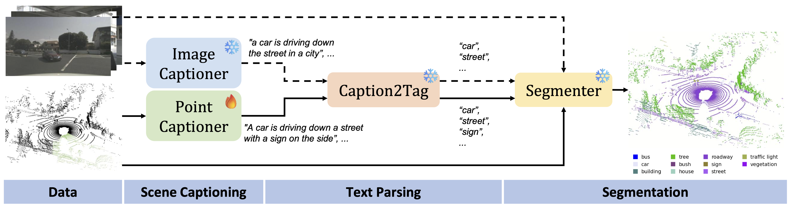

# [CVPR 2025] 3D-AVS: LiDAR-based 3D Auto-Vocabulary Segmentation

**[Atlas Lab, University of Amsterdam & TomTom](https://www.icai.ai/labs/atlas-lab)**

[Weijie Wei$^*$](https://github.com/codename1995), [Osman Ülger$^*$](ozzyou.github.io), [Fatemeh Karimi Nejadasl](https://fkariminejadasl.github.io), [Theo Gevers](https://staff.fnwi.uva.nl/th.gevers), [Martin R. Oswald](https://oswaldm.github.io/)

[](https://ozzyou.github.io/3d-avs.github.io/)
[](https://arxiv.org/abs/2406.09126v3)

---


## 🏠 About

**3D-AVS** is a method for Auto-Vocabulary Segmentation of 3D point clouds for which the vocabulary is unknown and
auto-generated for each input at runtime, thus eliminating the human in the loop and typically providing a substantially
larger vocabulary for richer annotations. 3D-AVS first recognizes semantic entities from image or point cloud data and
then segments all points with the automatically generated vocabulary. Our method incorporates both image-based and
point-based recognition, enhancing robustness under challenging lighting conditions where geometric information from
LiDAR is especially valuable. Our point-based recognition features a Sparse Masked Attention Pooling (SMAP) module to
enrich the diversity of recognized objects.

<p align="center">
  
</p>

---

## 🔥 News

- [2025/07/18] The code will be released soon.

## TODO

### Point Captioner

- [x] Release the training code and inference code.
- [x] Release the pre-trained weights.
- [ ] Release the pre-processing code for nuscenes.

### 3D-AVS
- [ ] Release the evaluation code.

## Installation

Follow the [installation.md](installation.md) to install all required packages so you can walk through the pipeline.

## Data Preparation

Please follow the [instruction](https://github.com/pengsongyou/openscene?tab=readme-ov-file#data-preparation) of
openscene to prepare the dataset.

```
data
│── nuscenes_official
│   │── samples
│   └── ...
│
│── nuscenes_openscene
│   │── nuscenes_multiview_openseg
│   └── ...
│
│── nuscenes_processed
│   └── smap
│       │── cached_img_clip_feature_train.pt
│       │── cached_img_clip_feature_val.pt
│       │── nuscenes_camera_id_mask_train.pt
│       └── nuscenes_camera_id_mask_val.pt
│
│── scannet
│   │── ...
│── scannet200
│   │── ...
```

## Training & Testing

### Point Captioner (SMAP)
1. For training SMAP, simply run

```
# nuScenes dataset
sh run/train_smap.sh

# and move the ckpt
mv output/smap_nuscenes/model/model_epoch_20.pth.tar ckpt/smap_model_epoch_20.pth.tar
```

2. To use point captioner to caption point clouds, run

```
# nuScenes dataset
sh point_captioner/infer.sh
```

Note to set the correct path for python interpreter in the script. Also, download the pre-trained weights from [here](https://drive.google.com/file/d/1aBuSIzMheip9dPZTiUVkY8ww8253UJhr/view?usp=sharing) and place it under `ckpt/' or train the SMAP model from scratch.


3. The inference results will be saved in `tmp/point_captioner_output/nuscenes/` as `smap_output_lidar_only_12.json`. As an alternative to continue, you can also download it from [here](https://drive.google.com/file/d/1GsbgQElcfQTPo3kLpNYUExK-p-JMGMak/view?usp=sharing).


### Image Captioner (To be updated)


### Caption2Tag (To be updated)
With the captions, we can now generate tags for the point clouds. To do so, run
```

```

### Segmentation & Evaluation (To be updated)

```

```

## Citation

If you find this repository useful, please consider citing our paper.

```
@inproceedings{wei20253davs,
      title={{3D-AVS}: LiDAR-based 3D Auto-Vocabulary Segmentation},
      author={Weijie Wei, Osman Ülger, Fatemeh Karimi Nejadasl, Theo Gevers and Martin R. Oswald},
      booktitle={Conference on Computer Vision and Pattern Recognition (CVPR)},
      year={2025},
}
```

## Acknowledgements

This project is mainly based on the following repositories:

- [openscene](https://github.com/pengsongyou/openscene)
- [LidarCLIP](https://github.com/atonderski/lidarclip)
- [ClipCap](https://github.com/rmokady/CLIP_prefix_caption)
- [Point Transformer V3](https://github.com/Pointcept/PointTransformerV3)

We would like to thank the authors for their great work.
