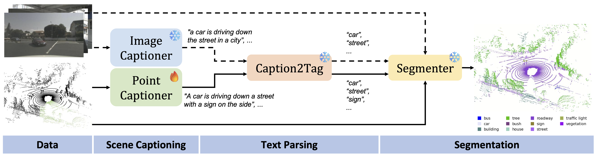

# 3D-AVS: LiDAR-based 3D Auto-Vocabulary Segmentation
**[Atlas Lab, University of Amsterdam & TomTom](https://www.icai.ai/labs/atlas-lab)**

[Weijie Wei](https://github.com/codename1995), [Osman Ülger](ozzyou.github.io), [Fatemeh Karimi Nejadasl](https://fkariminejadasl.github.io), [Theo Gevers](https://staff.fnwi.uva.nl/th.gevers), [Martin R. Oswald](https://oswaldm.github.io/)

[[`Paper`](https://arxiv.org/html/2406.09126v1)] [[`Project`](https://ozzyou.github.io/3d-avs.github.io/)]

**3D-AVS** is a method for Auto-Vocabulary Segmentation of 3D point clouds for which the vocabulary is unknown and auto-generated for each input at runtime, thus eliminating the human in the loop and typically providing a substantially larger vocabulary for richer annotations. 3D-AVS first recognizes semantic entities from image or point cloud data and then segments all points with the automatically generated vocabulary. Our method incorporates both image-based and point-based recognition, enhancing robustness under challenging lighting conditions where geometric information from LiDAR is especially valuable. Our point-based recognition features a Sparse Masked Attention Pooling (SMAP) module to enrich the diversity of recognized objects. 

<p align="center">
  
</p>

## Cite
```
@inproceedings{wei20253davs,
      title={3D-AVS: LiDAR-based 3D Auto-Vocabulary Segmentation},
      author={Weijie Wei and Osman Ülger and Fatemeh Karimi Nejadasl and Theo Gevers and Martin R. Oswald},
      booktitle={Conference on Computer Vision and Pattern Recognition (CVPR)},
      year={2025},
}
```
